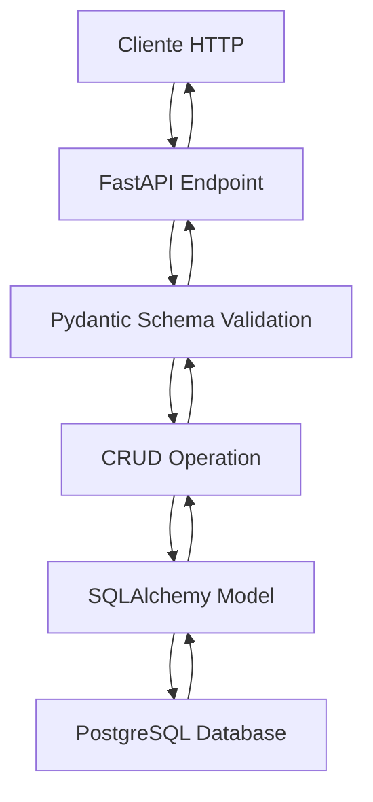

# 🚀 Guía de Instalación - Fase 0: Infraestructura Base

## ✅ Estado Actual

La **Fase 0** está **COMPLETA** y lista para usar. Tienes toda la infraestructura base configurada:

### 📁 Archivos creados:
- ✅ `requirements.txt` - Dependencias Python
- ✅ `docker-compose.yml` - Configuración Docker con PostgreSQL + PgAdmin
- ✅ `Dockerfile` - Imagen de la aplicación FastAPI
- ✅ `alembic.ini` - Configuración de migraciones
- ✅ `.env.example` - Plantilla de variables de entorno
- ✅ `.gitignore` - Archivos a ignorar en Git
- ✅ `scripts/load_data.py` - Script para cargar datos CSV
- ✅ `Makefile` - 40+ comandos para gestión completa

### 📊 Infraestructura disponible:
- ✅ **PostgreSQL** configurado en Docker
- ✅ **PgAdmin** para gestión gráfica de la base de datos
- ✅ **FastAPI** con estructura modular
- ✅ **SQLAlchemy** + Alembic para ORM y migraciones
- ✅ **Datos CSV** listos para cargar (46 clientes, 150 productos, etc.)
- ✅ **Script SQL** con 13 tablas completas

---

## 🏗️ **ARQUITECTURA IMPLEMENTADA - EXPLICACIÓN DETALLADA**

### 🎯 **Visión General del Sistema**

AInstalia utiliza una **arquitectura en capas modular** que separa responsabilidades y permite escalabilidad. El sistema está diseñado para ser un **backend API robusto** que soportará múltiples agentes IA especializados en diferentes funciones empresariales.

```
┌─────────────────────────────────────────────────────────────┐
│                    🌐 CAPA DE API (FastAPI)                 │
├─────────────────────────────────────────────────────────────┤
│                📋 CAPA DE ESQUEMAS (Pydantic)              │
├─────────────────────────────────────────────────────────────┤
│                🔧 CAPA DE LÓGICA (CRUD Operations)         │
├─────────────────────────────────────────────────────────────┤
│                📊 CAPA DE MODELOS (SQLAlchemy)             │
├─────────────────────────────────────────────────────────────┤
│                🗄️  BASE DE DATOS (PostgreSQL)              │
└─────────────────────────────────────────────────────────────┘
```

---

### 📱 **CAPA 1: API ENDPOINTS (FastAPI)**

**Propósito**: Exponer funcionalidades del sistema a través de HTTP REST API.

#### 📁 `backend/main.py`
```python
# Punto de entrada principal de la aplicación
# Configura FastAPI, middleware, CORS, y registra todos los routers
```
**Función**: 
- Inicializa la aplicación FastAPI
- Configura middleware de logging y CORS
- Registra todas las rutas de la API
- Define endpoints básicos como `/health`

#### 📁 `backend/api/`
**Estructura de endpoints por dominio**:
```
backend/api/
├── clients.py      # Endpoints CRUD para clientes
├── products.py     # Endpoints CRUD para productos  
├── warehouses.py   # Endpoints CRUD para almacenes
├── stock.py        # Endpoints CRUD para inventario
├── technicians.py  # Endpoints CRUD para técnicos
├── equipment.py    # Endpoints CRUD para equipos instalados
├── interventions.py # Endpoints CRUD para intervenciones
├── contracts.py    # Endpoints CRUD para contratos
├── orders.py       # Endpoints CRUD para pedidos
├── chat.py         # Endpoints para sesiones de chat
└── knowledge.py    # Endpoints para feedback de conocimiento
```

**Patrón de endpoints**:
- `GET /api/v1/clients/` - Listar todos los clientes
- `POST /api/v1/clients/` - Crear nuevo cliente  
- `GET /api/v1/clients/{id}` - Obtener cliente específico
- `PUT /api/v1/clients/{id}` - Actualizar cliente
- `DELETE /api/v1/clients/{id}` - Eliminar cliente

---

### 📋 **CAPA 2: ESQUEMAS DE VALIDACIÓN (Pydantic)**

**Propósito**: Validar, serializar y deserializar datos entre la API y la base de datos.

#### 📁 `backend/db/schemas/`
**Cada entidad tiene 4 esquemas principales**:

```python
# Ejemplo: client_schema.py
ClientBase          # Campos comunes compartidos
ClientCreate        # Datos para crear (sin ID, sin timestamps)
ClientUpdate        # Datos para actualizar (campos opcionales)
ClientResponse      # Datos de respuesta (incluye ID, timestamps)
```

**Archivos de esquemas**:
```
backend/db/schemas/
├── client_schema.py           # Validación de datos de clientes
├── product_schema.py          # Validación de datos de productos
├── warehouse_schema.py        # Validación de datos de almacenes
├── stock_schema.py           # Validación de datos de inventario
├── technician_schema.py       # Validación de datos de técnicos
├── equipment_schema.py        # Validación de equipos instalados
├── intervention_schema.py     # Validación de intervenciones
├── contract_schema.py         # Validación de contratos
├── order_schema.py           # Validación de pedidos
├── chat_session_schema.py     # Validación de sesiones de chat
├── chat_message_schema.py     # Validación de mensajes de chat
└── knowledge_feedback_schema.py # Validación de feedback
```

**Características avanzadas implementadas**:
- **Validaciones Enum**: `user_type`, `status` con valores específicos
- **Validaciones de email**: Formato correcto de emails
- **Campos opcionales**: `message_timestamp` auto-asignado
- **Tipos específicos**: `Decimal` para precios, `datetime` para timestamps

---

### 🔧 **CAPA 3: LÓGICA DE NEGOCIO (CRUD Operations)**

**Propósito**: Implementar operaciones de negocio y acceso a datos de manera consistente.

#### 📁 `backend/crud/`
**Operaciones CRUD estandarizadas**:

```python
# Patrón estándar para todas las entidades
async def create(db: Session, obj_in: SchemaCreate) -> Model
async def get(db: Session, id: int) -> Model | None
async def get_multi(db: Session, skip: int = 0, limit: int = 100) -> List[Model]
async def update(db: Session, db_obj: Model, obj_in: SchemaUpdate) -> Model
async def delete(db: Session, id: int) -> Model | None
```

**Archivos CRUD**:
```
backend/crud/
├── base.py              # Clase base con operaciones comunes
├── client_crud.py       # Operaciones específicas para clientes
├── product_crud.py      # Operaciones específicas para productos
├── warehouse_crud.py    # Operaciones específicas para almacenes
├── stock_crud.py        # Operaciones específicas para inventario
├── technician_crud.py   # Operaciones específicas para técnicos
├── equipment_crud.py    # Operaciones específicas para equipos
├── intervention_crud.py # Operaciones específicas para intervenciones
├── contract_crud.py     # Operaciones específicas para contratos
├── order_crud.py        # Operaciones específicas para pedidos
├── chat_crud.py         # Operaciones específicas para chat
└── knowledge_crud.py    # Operaciones específicas para knowledge
```

**Funcionalidades avanzadas**:
- **Paginación**: Limitación y offset para grandes datasets
- **Filtros**: Búsqueda por múltiples criterios
- **Relaciones**: Carga eficiente de datos relacionados
- **Transacciones**: Operaciones atómicas para integridad de datos

---

### 📊 **CAPA 4: MODELOS DE DATOS (SQLAlchemy ORM)**

**Propósito**: Mapear objetos Python a tablas de base de datos con relaciones y restricciones.

#### 📁 `backend/db/models/`
**Modelos de entidades principales**:

```
backend/db/models/
├── client_model.py       # Modelo de clientes
├── product_model.py      # Modelo de productos
├── warehouse_model.py    # Modelo de almacenes
├── stock_model.py        # Modelo de inventario
├── technician_model.py   # Modelo de técnicos
├── equipment_model.py    # Modelo de equipos instalados
├── intervention_model.py # Modelo de intervenciones
├── contract_model.py     # Modelo de contratos
├── order_model.py        # Modelo de pedidos y items
├── chat_model.py         # Modelo de sesiones y mensajes
└── knowledge_model.py    # Modelo de feedback de conocimiento
```

**Características de los modelos**:
- **Relaciones bidireccionales**: `relationship()` con `back_populates`
- **Restricciones de integridad**: Foreign Keys, Check constraints
- **Índices**: Para optimización de consultas
- **Tipos específicos**: `JSON`, `Numeric`, `Date`, `DateTime`

**Ejemplo de relaciones implementadas**:
```python
# Client -> Orders (uno a muchos)
client.orders = relationship("Order", back_populates="client")

# Order -> OrderItems (uno a muchos)  
order.items = relationship("OrderItem", back_populates="order")

# Product -> OrderItems (uno a muchos)
product.order_items = relationship("OrderItem", back_populates="product")
```

---

### 🗄️ **CAPA 5: BASE DE DATOS (PostgreSQL)**

**Propósito**: Almacenamiento persistente y confiable de todos los datos del sistema.

#### 📁 `sql/create_tables.sql`
**13 tablas principales implementadas**:

1. **`clients`** - Información de clientes
2. **`products`** - Catálogo de productos
3. **`warehouses`** - Almacenes de la empresa
4. **`stock`** - Inventario por almacén
5. **`technicians`** - Personal técnico
6. **`installed_equipment`** - Equipos instalados en clientes
7. **`interventions`** - Intervenciones técnicas realizadas
8. **`contracts`** - Contratos con clientes
9. **`orders`** - Pedidos de clientes
10. **`order_items`** - Items específicos de cada pedido
11. **`chat_sessions`** - Sesiones de chat con clientes
12. **`chat_messages`** - Mensajes individuales del chat
13. **`knowledge_feedback`** - Feedback para mejorar la base de conocimiento

**Características de la base de datos**:
- **Integridad referencial**: Foreign Keys entre todas las tablas relacionadas
- **Tipos de datos optimizados**: `NUMERIC` para precios, `JSONB` para datos flexibles
- **Índices**: Primary keys e índices en campos frecuentemente consultados
- **Restricciones**: Check constraints para valores válidos

---

### ⚙️ **CAPA 6: CONFIGURACIÓN Y UTILIDADES**

#### 📁 `backend/core/`
**Configuración central del sistema**:

```
backend/core/
├── config.py       # Configuración de variables de entorno
├── database.py     # Configuración de conexión a PostgreSQL
├── logging.py      # Sistema de logging estructurado
└── security.py     # Funciones de seguridad (futuras)
```

#### 📁 `backend/db/base.py`
```python
# Configuración base de SQLAlchemy
# Importa todos los modelos para Alembic
# Define la clase Base para todos los modelos
```

---

### 🧪 **CAPA 7: TESTING AUTOMATIZADO**

#### 📁 `backend/tests/phase_0/`
**Tests exhaustivos para cada capa**:

```
backend/tests/phase_0/
├── conftest.py        # Fixtures compartidas con datos de prueba
├── test_models.py     # Tests de modelos SQLAlchemy
├── test_schemas.py    # Tests de esquemas Pydantic
└── test_crud.py       # Tests de operaciones CRUD
```

**Cobertura de tests**:
- ✅ **24/24 tests pasando**
- ✅ Validación de todos los modelos
- ✅ Validación de todos los esquemas
- ✅ Operaciones CRUD para todas las entidades
- ✅ Manejo de errores y validaciones
- ✅ Paginación y filtros

---

### 🔄 **FLUJO DE DATOS COMPLETO**



**Ejemplo de flujo completo** (Crear un cliente):

1. **HTTP POST** `/api/v1/clients/` con JSON
2. **FastAPI** recibe la petición en `clients.py`
3. **Pydantic** valida datos con `ClientCreate` schema
4. **CRUD** ejecuta `client_crud.create()`
5. **SQLAlchemy** mapea a modelo `Client`
6. **PostgreSQL** guarda en tabla `clients`
7. **Respuesta** regresa por el mismo flujo con `ClientResponse`

---

### 🛠️ **HERRAMIENTAS DE DESARROLLO**

#### 📁 `Makefile`
**40+ comandos para gestión completa**:
- `make up` - Levantar todos los servicios
- `make test` - Ejecutar suite de tests
- `make shell-db` - Acceso directo a PostgreSQL
- `make pgadmin` - Abrir PgAdmin en navegador
- `make logs` - Ver logs de todos los servicios

#### 📁 `docker-compose.yml`
**Servicios containerizados**:
- **PostgreSQL**: Base de datos principal
- **PgAdmin**: Interfaz gráfica para DB
- **FastAPI App**: Aplicación backend

#### 📁 `Dockerfile`
**Imagen optimizada**:
- Python 3.11 slim
- Dependencias en capas para cache
- Usuario no-root para seguridad

---

### 🔗 **CONEXIONES ENTRE CAPAS**

#### **1. API ↔ Schemas**
```python
# FastAPI usa Pydantic automáticamente
@app.post("/clients/", response_model=ClientResponse)
async def create_client(client: ClientCreate):
    # client ya está validado por Pydantic
```

#### **2. Schemas ↔ CRUD**
```python
# CRUD recibe schemas validados
async def create(db: Session, obj_in: ClientCreate) -> Client:
    db_obj = Client(**obj_in.model_dump())
```

#### **3. CRUD ↔ Models**
```python
# CRUD opera directamente con modelos SQLAlchemy
db_obj = Client(name="Test", email="test@example.com")
db.add(db_obj)
db.commit()
```

#### **4. Models ↔ Database**
```python
# SQLAlchemy maneja la comunicación con PostgreSQL
# Genera SQL automáticamente basado en los modelos
```

---

### 🎯 **BENEFICIOS DE ESTA ARQUITECTURA**

#### ✅ **Separación de Responsabilidades**
- Cada capa tiene una función específica
- Cambios en una capa no afectan las otras
- Facilita mantenimiento y testing

#### ✅ **Escalabilidad**
- Fácil agregar nuevas entidades
- Patrones consistentes en todo el sistema
- Preparado para microservicios futuros

#### ✅ **Robustez**
- Validación en múltiples niveles
- Manejo consistente de errores
- Transacciones de base de datos

#### ✅ **Desarrollo Ágil**
- Tests automatizados
- Documentación automática (FastAPI docs)
- Comandos de Makefile para productividad

#### ✅ **Preparado para IA**
- Estructura modular para agentes especializados
- APIs bien definidas para integración
- Base de datos rica para entrenamiento

---

## 🔧 Pasos para ejecutar la Fase 0

### 1. **Preparar entorno**
```bash
# Clonar/estar en el directorio del proyecto
cd AInstalia

# Crear archivo .env basado en .env.example
cp .env.example .env
# o usando el Makefile:
make setup-env

# Editar .env con tus configuraciones reales (opcional)
nano .env
```

### 2. **Ejecutar con Docker (recomendado)**
```bash
# 🐳 Con Docker NO necesitas instalar Python ni crear entorno virtual
# Todo está containerizado

# Construir y ejecutar servicios
docker-compose up --build
# o usando el Makefile:
make up

# En otra terminal, verificar que todo funciona
curl http://localhost:8001/health
```

### 3. **Configurar PgAdmin**
```bash
# Abrir PgAdmin automáticamente
make pgadmin

# O manualmente ir a: http://localhost:5051
# Credenciales:
# Email: admin@ainstalia.com
# Password: admin123

# Ver instrucciones de configuración
make setup-pgadmin
```

### 4. **Verificar base de datos**
```bash
# Opción 1: Conectar por línea de comandos
make shell-db

# Verificar tablas creadas
\dt

# Ver datos de ejemplo
SELECT COUNT(*) FROM clients;
SELECT COUNT(*) FROM products;

# Opción 2: Usar PgAdmin (interfaz gráfica)
# Ir a http://localhost:5050 y seguir las instrucciones
```

### 5. **Cargar datos CSV (opcional)**
```bash
# Si quieres cargar los datos CSV adicionales
# Esto se ejecuta DENTRO del contenedor
make load-data
```

## 💡 **¿Cuándo SÍ necesitas entorno virtual?**

Solo si quieres desarrollar **fuera de Docker** (no recomendado para este proyecto):

```bash
# Solo para desarrollo local SIN Docker:
python -m venv venv
source venv/bin/activate  # Linux/Mac
pip install -r requirements.txt
```

**Pero con nuestro setup de Docker, esto NO es necesario** ✅

## 🧪 Probar la API

Una vez ejecutando, puedes probar:

```bash
# Endpoint de salud
curl http://localhost:8001/health

# Documentación automática de FastAPI
http://localhost:8001/docs

# Endpoint raíz
curl http://localhost:8001/
```

## 🌐 URLs de servicios

| Servicio | URL | Credenciales |
|----------|-----|--------------|
| **FastAPI** | http://localhost:8001 | - |
| **API Docs** | http://localhost:8001/docs | - |
| **PgAdmin** | http://localhost:5051 | admin@ainstalia.com / admin123 |
| **PostgreSQL** | localhost:5433 | user / password |

## 🎛️ Configurar PgAdmin paso a paso

1. **Acceder a PgAdmin**: http://localhost:5051
2. **Login**:
   - Email: `admin@ainstalia.com`
   - Password: `admin123`
3. **Crear servidor**:
   - Click derecho en "Servers" → "Create" → "Server"
4. **Configuración**:
   - **General tab**:
     - Name: `AInstalia`
   - **Connection tab**:
     - Host: `postgres`
     - Port: `5432`
     - Database: `ainstalia_db`
     - Username: `user`
     - Password: `password`
5. **Guardar**: Click "Save"

¡Ya tienes acceso gráfico completo a la base de datos! 🎉

## 📋 Verificación de Fase 0 Completa

Confirma que tienes:

- [ ] ✅ PostgreSQL corriendo en puerto 5433
- [ ] ✅ PgAdmin corriendo en puerto 5051
- [ ] ✅ FastAPI corriendo en puerto 8001
- [ ] ✅ 13 tablas creadas en la base de datos
- [ ] ✅ PgAdmin conectado a PostgreSQL
- [ ] ✅ Datos CSV disponibles para cargar
- [ ] ✅ API respondiendo correctamente
- [ ] ✅ Documentación en /docs accesible

## 🎯 Próximos pasos

Una vez que la Fase 0 esté funcionando:

1. **Fase 1**: Crear endpoints CRUD para todas las tablas
2. **Fase 2**: Integrar mensajería (WhatsApp + Chatwoot)
3. **Fase 3**: Implementar agentes IA especializados

## 🚀 Comandos útiles del Makefile

```bash
# Comandos básicos
make help           # Ver todos los comandos
make up             # Levantar servicios
make down           # Bajar servicios
make status         # Ver estado de contenedores

# Base de datos
make shell-db       # Acceso a PostgreSQL
make load-data      # Cargar datos CSV
make check-data     # Verificar datos
make db-backup      # Crear backup

# PgAdmin
make pgadmin        # Abrir PgAdmin en navegador
make setup-pgadmin  # Ver instrucciones de configuración
make logs-pgadmin   # Ver logs de PgAdmin

# Desarrollo
make dev            # Modo desarrollo
make test-api       # Probar API
make quick-start    # Inicio rápido completo
```

## 🆘 Resolución de problemas

### Error de conexión a base de datos:
```bash
# Verificar que PostgreSQL está ejecutando
docker-compose ps

# Ver logs
docker-compose logs postgres
# o
make logs-db
```

### PgAdmin no carga:
```bash
# Verificar logs de PgAdmin
make logs-pgadmin

# Verificar que el puerto 5050 no esté ocupado
netstat -tlnp | grep 5050
```

### Error al instalar dependencias:
```bash
# Actualizar pip
pip install --upgrade pip

# Instalar con verbose para ver errores
pip install -v -r requirements.txt
```

### Puerto ocupado:
```bash
# Cambiar puertos en docker-compose.yml si están ocupados
# Ejemplo para cambiar PgAdmin de 5050 a 5051:
# "5051:80" en lugar de "5050:80"
```

---

¡La Fase 0 está lista! 🎉 Con esta infraestructura completa (PostgreSQL + PgAdmin + FastAPI + Makefile) puedes proceder a desarrollar las siguientes fases del sistema multiagente. 