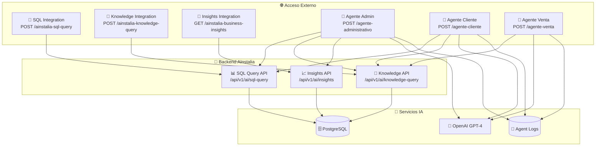

# AInstalia - Arquitectura de Workflows n8n

## 📋 Índice
1. [Visión General](#visión-general)
2. [Workflows Disponibles](#workflows-disponibles)
3. [Arquitectura de Conexiones](#arquitectura-de-conexiones)
4. [Tipos de Workflows](#tipos-de-workflows)
5. [Flujo de Datos](#flujo-de-datos)
6. [Casos de Uso](#casos-de-uso)
7. [Consideraciones de Seguridad](#consideraciones-de-seguridad)

## 🎯 Visión General

AInstalia cuenta con **6 workflows de n8n** diseñados para diferentes propósitos:
- **3 Workflows de Integración** (Proxies simples a APIs)
- **3 Workflows de Agentes IA** (Agentes conversacionales completos)

Estos workflows proporcionan tanto acceso directo a las capacidades de IA de AInstalia como agentes especializados para diferentes tipos de usuarios.

## 📊 Workflows Disponibles

### **Grupo 1: Workflows de Integración (API Proxies)**

#### 1. **SQL Query Integration**
- **Archivo**: `ainstalia-sql-query-integration.json`
- **Webhook**: `POST /ainstalia-sql-query`
- **Propósito**: Proxy directo al endpoint de consultas SQL con IA
- **Endpoint Backend**: `/api/v1/ai/sql-query`
- **Parámetros**:
  - `query` (string): Consulta en lenguaje natural
  - `user_role` (string): cliente|tecnico|administrador
  - `user_id` (number): ID del usuario
  - `include_sql` (boolean): Incluir SQL generado en respuesta

#### 2. **Knowledge Query Integration**
- **Archivo**: `ainstalia-knowledge-query-integration.json`
- **Webhook**: `POST /ainstalia-knowledge-query`
- **Propósito**: Proxy directo al sistema RAG de base de conocimientos
- **Endpoint Backend**: `/api/v1/ai/knowledge-query`
- **Parámetros**:
  - `query` (string): Consulta en lenguaje natural
  - `context` (string): Contexto adicional
  - `include_sources` (boolean): Incluir fuentes en respuesta

#### 3. **Business Insights Integration**
- **Archivo**: `ainstalia-business-insights-integration.json`
- **Webhook**: `GET /ainstalia-business-insights`
- **Propósito**: Proxy directo al generador de insights de BI
- **Endpoint Backend**: `/api/v1/ai/insights`
- **Parámetros**:
  - `user_role` (string): Role para filtrar insights

### **Grupo 2: Workflows de Agentes IA (Conversacionales)**

#### 4. **Agente Administrativo**
- **Archivo**: `agente-administrativo-workflow.json`
- **Webhook**: `POST /agente-administrativo`
- **Propósito**: Agente IA completo para administradores con acceso total
- **Características**:
  - ✅ **Acceso completo**: Todas las 13 tablas de la BD
  - ✅ **Consultas paralelas**: Knowledge + SQL + Insights simultáneas
  - ✅ **IA Avanzada**: GPT-4 para análisis estratégico
  - ✅ **Logging completo**: PostgreSQL tracking
  - ✅ **Sin restricciones**: Modo administrador unrestricted

#### 5. **Agente de Clientes**
- **Archivo**: `agente-cliente-workflow.json`
- **Webhook**: `POST /agente-cliente`
- **Propósito**: Agente IA especializado en soporte al cliente
- **Características**:
  - 🔒 **Acceso restringido**: Solo 8 tablas permitidas para clientes
  - 🎯 **Filtros de seguridad**: Solo datos del cliente específico
  - 🤖 **IA de soporte**: GPT-4 optimizado para customer service
  - 📊 **Búsqueda dual**: Knowledge base + datos específicos del cliente

#### 6. **Agente de Venta**
- **Archivo**: `agente-venta-workflow.json`
- **Webhook**: `POST /agente-venta`
- **Propósito**: Agente IA para ventas y captación de prospectos
- **Características**:
  - 🌐 **Acceso público**: No requiere autenticación específica
  - 📚 **Solo knowledge base**: Sin acceso a datos operacionales
  - 💼 **IA comercial**: GPT-4 optimizado para ventas
  - 📈 **Auto-mejora**: Sistema de feedback para gaps de conocimiento

## 🏗️ Arquitectura de Conexiones



## 🔄 Tipos de Workflows

### **Tipo A: Proxies de Integración**
```
Cliente → Webhook → AInstalia API → Respuesta Formateada
```
- **Ventajas**: Simplicidad, baja latencia, acceso directo
- **Uso**: Integraciones con sistemas externos, APIs programáticas
- **Workflows**: SQL, Knowledge, Insights Integration

### **Tipo B: Agentes Conversacionales**
```
Usuario → Webhook → [Múltiples APIs] → IA (GPT-4) → Respuesta Personalizada → Log
```
- **Ventajas**: Contexto enriquecido, respuestas personalizadas, aprendizaje
- **Uso**: Interfaces de usuario, chatbots, asistentes especializados
- **Workflows**: Agente Admin, Cliente, Venta

## 📊 Flujo de Datos Detallado

### **Agente Administrativo (Más Complejo)**
```
1. Webhook recibe consulta administrativa
2. Extract Data: Extrae query, admin_id, session_id
3. Parallel Search: Dispara 3 consultas simultáneas
   ├── Knowledge Search (contexto: administración)
   ├── SQL Query (modo unrestricted, todas las tablas)
   └── Business Insights (role: administrador)
4. Combine Data: Unifica resultados de las 3 fuentes
5. GPT-4: Genera respuesta estratégica basada en todos los datos
6. Log Interaction: Guarda en PostgreSQL con metadatos completos
7. Format Response: Estructura respuesta final
8. Respond: Envía al cliente
```

### **Agente Cliente (Seguridad Enfocada)**
```
1. Webhook recibe consulta de cliente
2. Extract Data: Extrae query, client_id, user_id
3. Parallel Search: 2 consultas paralelas
   ├── Knowledge Search (contexto: soporte)
   └── SQL Query (filtrado por client_id, solo 8 tablas)
4. Combine Data: Unifica resultados seguros
5. GPT-4: Genera respuesta de soporte personalizada
6. Log: Guarda interacción con client_id
7. Response: Respuesta segura y personalizada
```

### **Agente Venta (Público y Simple)**
```
1. Webhook recibe consulta de prospecto
2. Extract Data: query, user_id (puede ser anonymous)
3. Knowledge Search: Solo base de conocimientos (contexto: ventas)
4. Check Confidence: Evalúa calidad de la respuesta
5. [Si baja confianza] → Self-Feeding: Log gap de conocimiento
6. GPT-4: Genera respuesta comercial
7. Log: Guarda interacción de prospecto
8. Response: Respuesta orientada a ventas
```

## 🎯 Casos de Uso por Workflow

### **Integraciones (Proxies)**
- **SQL Integration**: 
  - Dashboards externos
  - Reportes automatizados
  - Integraciones con BI tools
  
- **Knowledge Integration**:
  - Chatbots de terceros
  - Sistemas de documentación
  - Búsquedas contextuales

- **Insights Integration**:
  - KPI dashboards
  - Alertas automáticas
  - Reportes ejecutivos

### **Agentes IA**
- **Agente Administrativo**:
  - Interface administrativa completa
  - Análisis estratégico profundo
  - Toma de decisiones ejecutivas
  
- **Agente Cliente**:
  - Portal de clientes
  - Soporte técnico automatizado
  - Consultas específicas de cuenta

- **Agente Venta**:
  - Website corporativo
  - Chat de ventas
  - Calificación de leads

## 🔒 Consideraciones de Seguridad

### **Niveles de Acceso**

| Workflow | Autenticación | Tablas BD | Filtros | Datos Sensibles |
|----------|---------------|-----------|---------|-----------------|
| **SQL Integration** | ❌ Pública | Según role | Por user_role | Según role |
| **Knowledge Integration** | ❌ Pública | N/A | Ninguno | No |
| **Insights Integration** | ❌ Pública | Según role | Por user_role | Según role |
| **Agente Admin** | 🔑 API Key | Todas (13) | Ninguno | Sí |
| **Agente Cliente** | 🔑 API Key | Cliente (8) | Por client_id | Solo cliente |
| **Agente Venta** | 🔑 API Key | N/A | Ninguno | No |

### **Medidas de Seguridad Implementadas**

1. **Filtrado por Role**: Cada workflow respeta los permisos del sistema AInstalia
2. **Client ID Filtering**: Los datos se filtran por cliente específico
3. **API Key Authentication**: Workflows de agentes requieren autenticación
4. **SQL Injection Protection**: Hereda las protecciones del backend AInstalia
5. **Logging Completo**: Todas las interacciones se registran para auditoría

## 🚀 Próximos Pasos

1. **Validación**: Usar herramientas n8n-MCP para validar workflows
2. **Despliegue**: Activar workflows en instancia n8n
3. **Testing**: Probar cada endpoint con casos reales
4. **Monitoreo**: Implementar alertas y métricas de uso
5. **Optimización**: Ajustar basado en patrones de uso

## 📝 Notas Técnicas

- **Concurrencia**: Los agentes usan consultas paralelas para optimizar performance
- **Resilencia**: Timeouts de 30s y 3 reintentos en llamadas HTTP
- **Logging**: PostgreSQL tracking para análisis y mejora continua
- **Escalabilidad**: Arquitectura stateless permite escalado horizontal
- **Mantenimiento**: Workflows independientes facilitan actualizaciones incrementales 